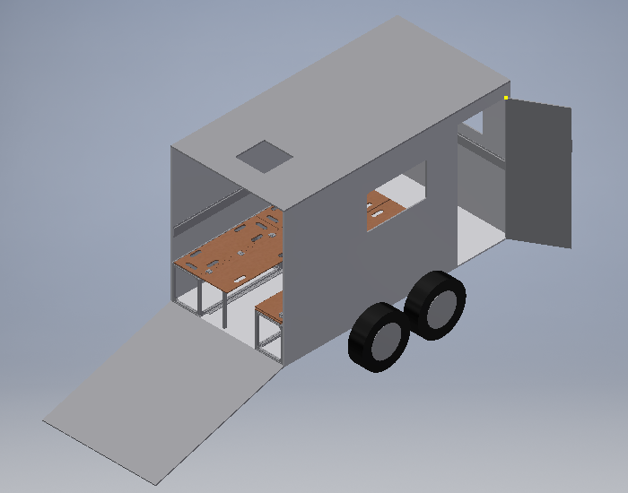
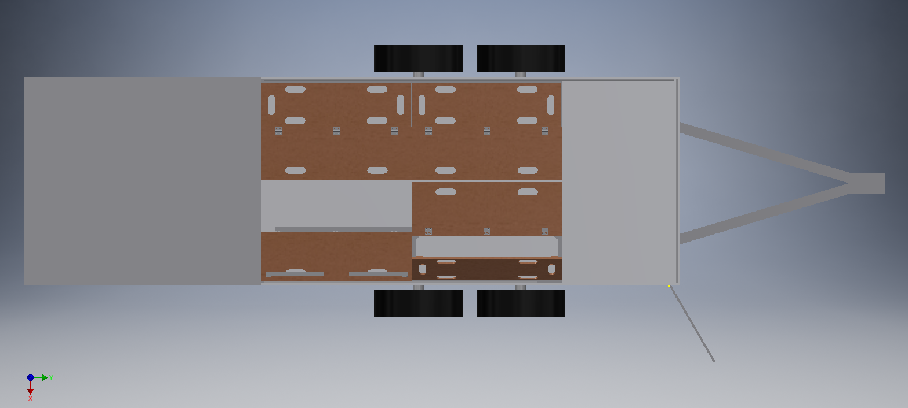
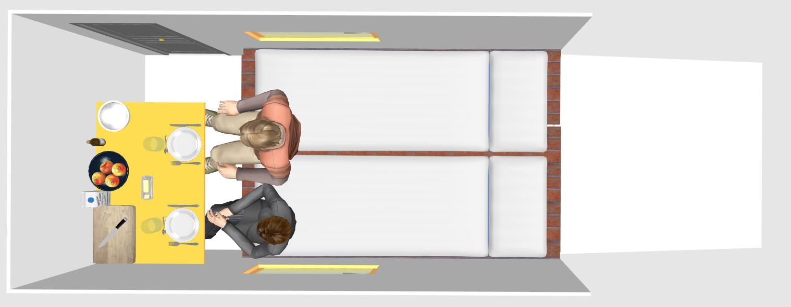
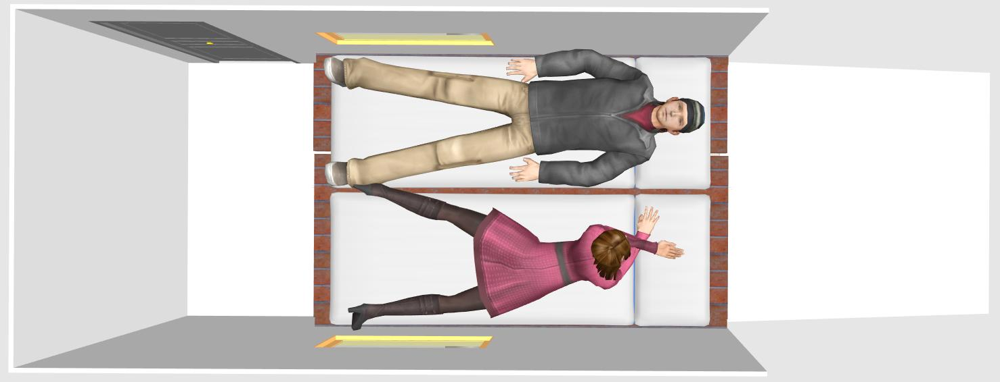
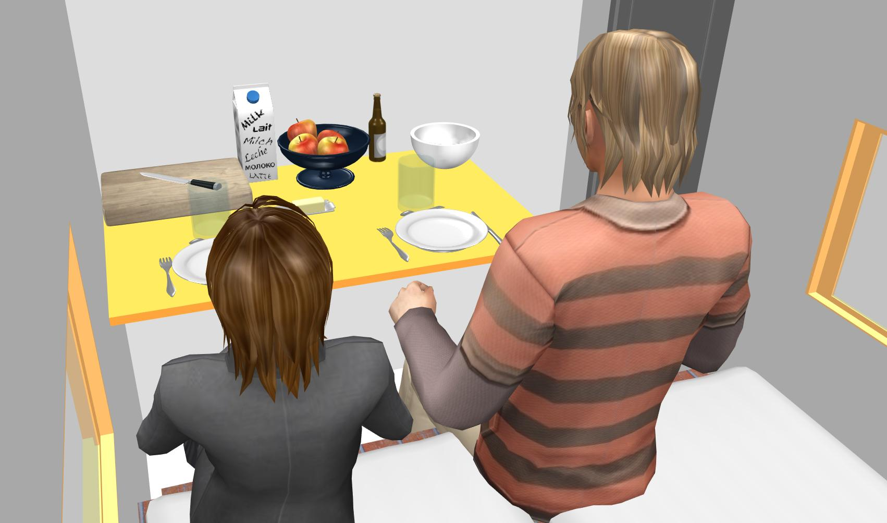
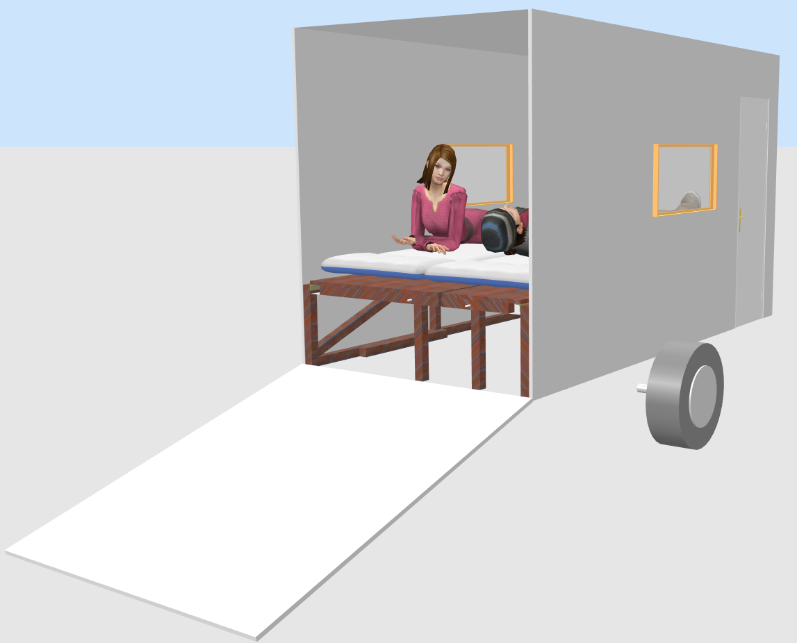

# Skizzen des Anhängers

## aktueller Entwurf
* mit [Autodesk Inventor](https://de.wikipedia.org/wiki/Autodesk_Inventor)
* Tandemanhänger
* Seitentür rechts
* Fenster rechts und vorne
* mit Dachfenster
* [verschiedene Bettkonstruktionen](bettkonstruktion.md) aus Aluprofilen
* **die Konstruktion ist noch nicht fertig**

## Erste Skizzen
* mit [SweetHome3D](http://www.sweethome3d.com/) gezeichnet - siehe auch [Ubuntu-Wiki](https://wiki.ubuntuusers.de/Sweet_Home_3D/)
* einachsiger Anhänger
* Seitentür rechts
* Fenster rechts und links
* kein Dachfenster
* Bettkonstruktion aus Holz und ähnlich der Dreamboxxx

