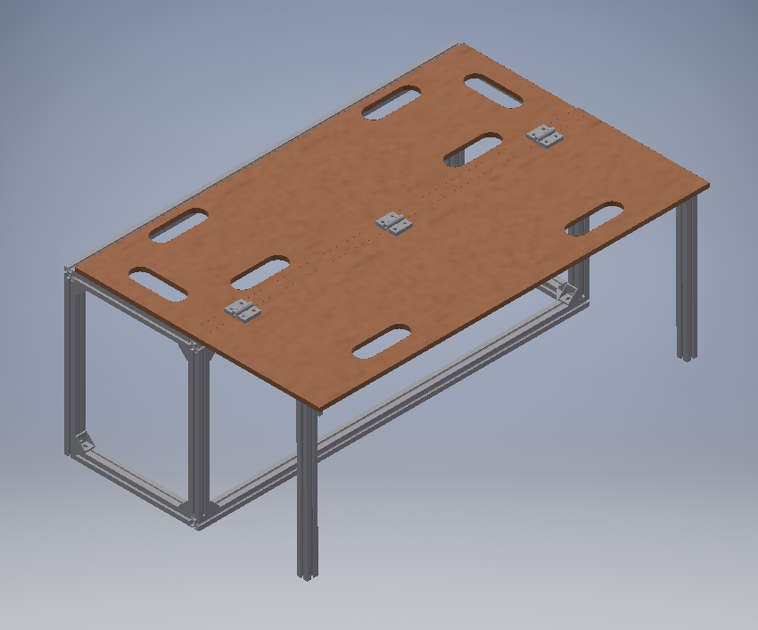
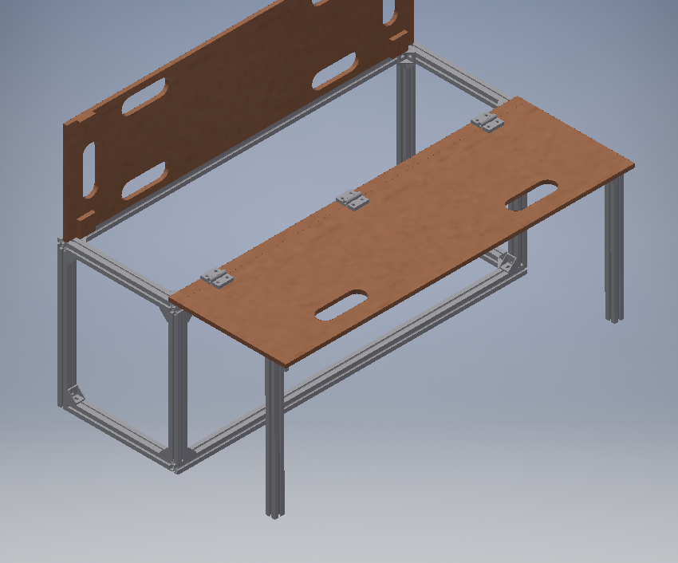
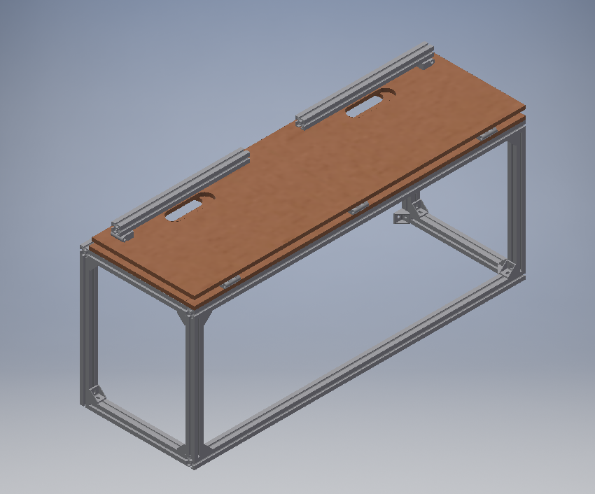
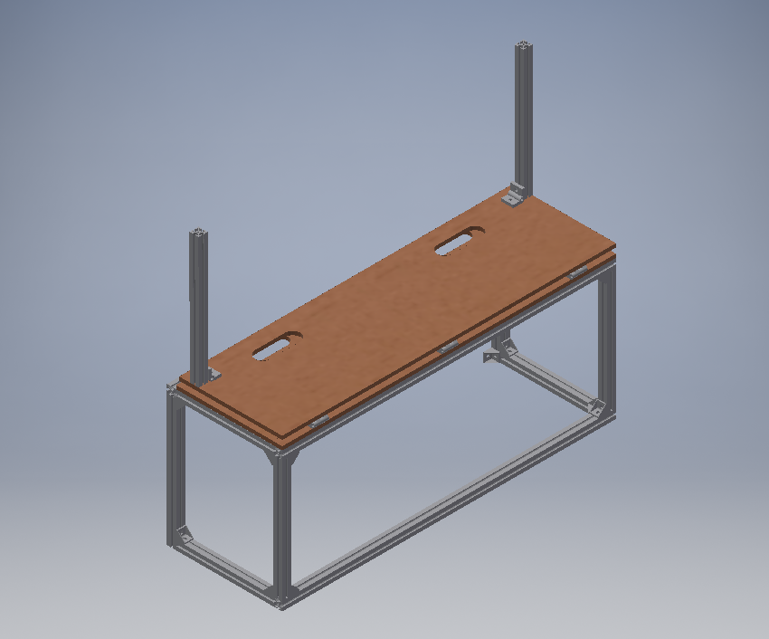
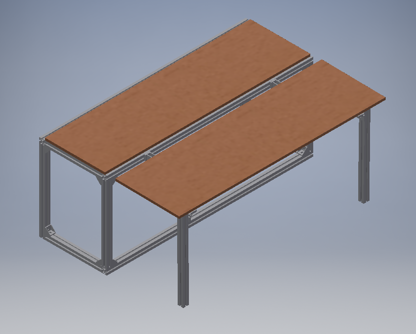
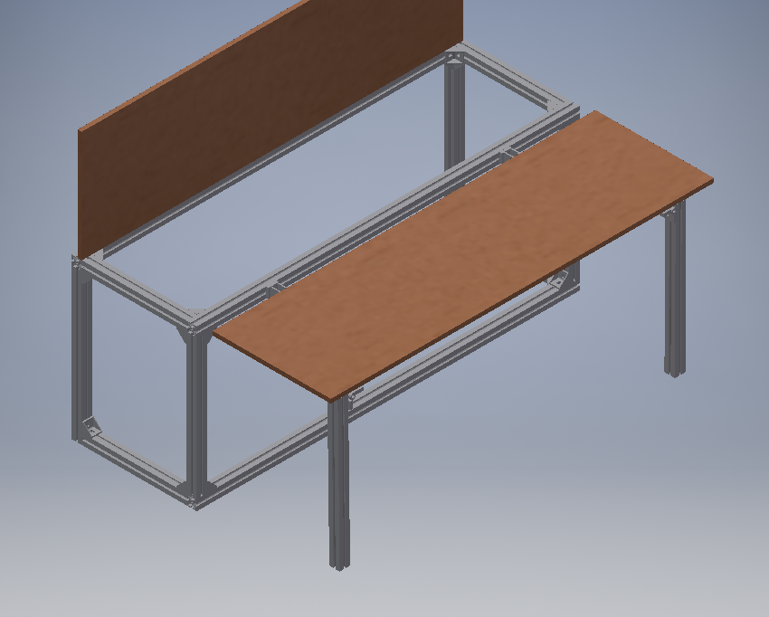
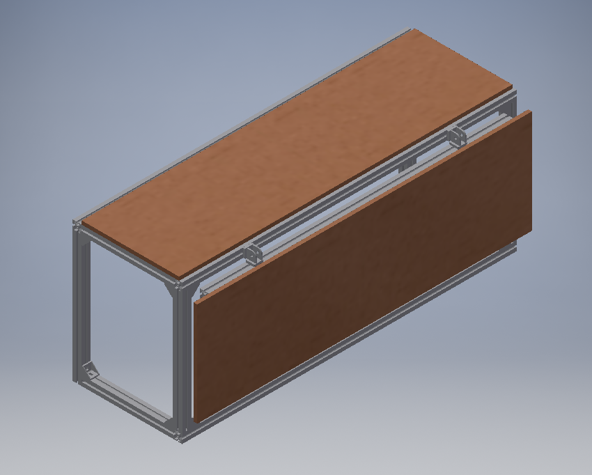
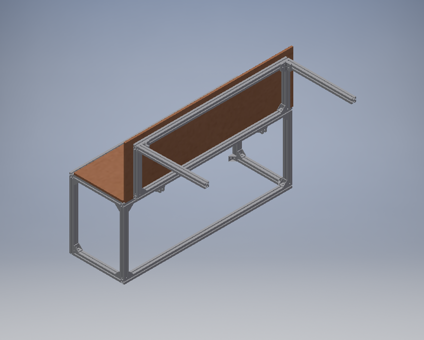

# Bettkonstruktionen
## aktueller Entwurf (V3)
* [Technische Zeichnung](02_inventor/export/2020_04_19/bett_V3/bett_V3_zeichnung.pdf)
* Sitzreihe mit statischer Breite von **38cm**
* Klappteil
    * 36,5cm breit
    * ohne Rahmenkonstruktion aus Aluprofilen
    * wird **nach oben** weggeklappt
* Verbindung über 3 Plastewinkel mit 2 je Schraublöchern

## Verison 2
* Sitzreihe mit statischer Breite von 36cm
* Klappteil
    * Rahmenkonstruktion aus Aluprofilen _(31cm breit)_
    * wird nach unten weggeklappt
    * _kann auch vertikal hochgeklappt werden_
* Verbindung über 2 (teure) Aluwinkel

